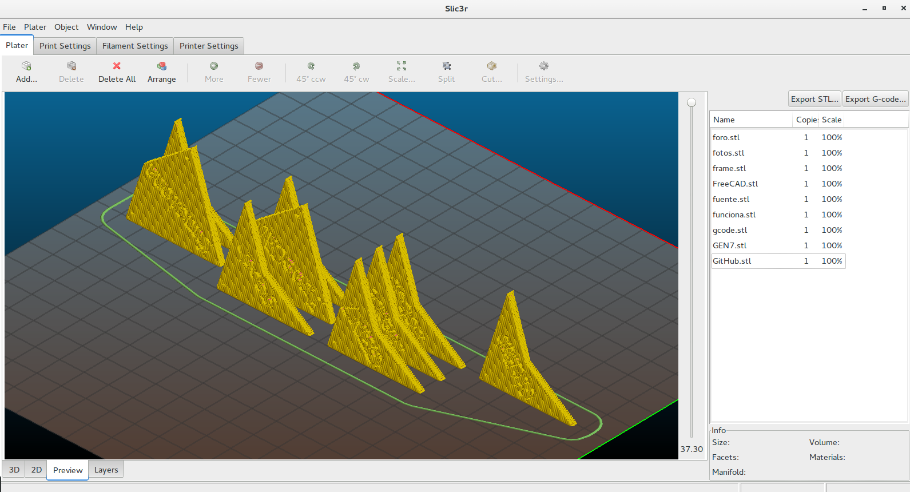

# Reto CloneWars Aperiódico - OSHWDem 2016
Teselacion de Penrose (P2) con el texto de las palabras más frecuentes en los asuntos de la lista de correo CloneWars

  

La carpeta [STLs](STLs) contiene los 472 ficheros STLs de las teselas, de lado 40mm, tolerancia 0.25mm, y ya orientadas para imprimir en vertical (ver captura mas abajo).
Los taladros de referencia atraviesan la pieza, por si queremos coser las teselas con un hilo.

Salen 189 cometas y 283 flechas (las flechas son las palabras cortas), así que habría que intentar imprimir mas de las cometas para balancear la cantidad.

Las piezas tienen texto a ambos lados, para permitir corregir la orientación de los textos que surjan dentro del mosaico.

  
_Las piezas se imprimen en vertical para ahorrar espacio y aumentar la calidad del texto_

¡El debate continúa en la lista de correo!
==
<https://groups.google.com/d/topic/asrob-uc3m-impresoras-3d/1xUjr2cjcSo/discussion>

¿Quieres personalizar tus teselas? ¡Mira este paso a paso en FreeCAD!
--
<https://github.com/Obijuan/3D-parts/wiki/Piezas-para-la-Teselaci%C3%B3n-de-Penrose-P2#piezas-con-texto>

¿Como generar teselas de manera automatica?
--
Instalar **OpenScad**. Desde linux, lanzar el script como:

```
CUSTOMIZAR_PIEZA.sh
```
Entonces basta con ir tecleando palabras y pulsar ENTER para cada una, así se van generando los .stl en la misma carpeta del script.

Para generar toda la lista de palabras
```
cat lista_palabras.txt | ./generate_stls.sh
cat lista_etiquetas.txt | ./generate_stls.sh
```

Tambien se puede abrir el fichero **penrose.scad** con OpenScad, y cambiar la variable "texto" que hay al final del documento. Renderizar con F6 y exportar el STL customizado.


# Recuerda marcar las que vayas a imprimir en esta hoja compartida:  

<https://docs.google.com/spreadsheets/d/1uD2_QQN5FQzhx-X0O5jLnv0Mfa9GLHLmWsaY0qJ4cSo/edit#gid=0>


# ¡Descarga las teselas!

¡Las piezas repetidas, también vienen bien! Formaremos frases con ellas el dia del evento.  

[[APORTE]](STLs/[APORTE].stl) [[AYUDA]](STLs/[AYUDA].stl) [[CAMACALIENTE]](STLs/[CAMACALIENTE].stl) [[CAMISETAS]](STLs/[CAMISETAS].stl) [[CATNOZZLE]](STLs/[CATNOZZLE].stl) [[COMPRA]](STLs/[COMPRA].stl) [[COMPRO]](STLs/[COMPRO].stl) [[CONJUNTA]](STLs/[CONJUNTA].stl) [[CONSULTA]](STLs/[CONSULTA].stl) [[DESARROLLO]](STLs/[DESARROLLO].stl) [[DONACIÓN]](STLs/[DONACIÓN].stl) [[DUDA]](STLs/[DUDA].stl) [[DUDAS]](STLs/[DUDAS].stl) [[ELECTRÓNICA]](STLs/[ELECTRÓNICA].stl) [[EVENTO]](STLs/[EVENTO].stl) [[FILAMENTO]](STLs/[FILAMENTO].stl) [[FREECAD]](STLs/[FREECAD].stl) [[HARDWARE]](STLs/[HARDWARE].stl) [[HOJADERUTA]](STLs/[HOJADERUTA].stl) [[HOTEND]](STLs/[HOTEND].stl) [[MEJORA]](STLs/[MEJORA].stl) [[MODELOS]](STLs/[MODELOS].stl) [[NACIMIENTO]](STLs/[NACIMIENTO].stl) [[NOTICIA]](STLs/[NOTICIA].stl) [[NOVEDAD]](STLs/[NOVEDAD].stl) [[NUEVO]](STLs/[NUEVO].stl) [[OFERTA]](STLs/[OFERTA].stl) [[OFFTOPIC]](STLs/[OFFTOPIC].stl) [[PEDIDO]](STLs/[PEDIDO].stl) [[PETICIÓN]](STLs/[PETICIÓN].stl) [[PREGUNTA]](STLs/[PREGUNTA].stl) [[PRESENTACIÓN]](STLs/[PRESENTACIÓN].stl) [[PRINTERPARTY]](STLs/[PRINTERPARTY].stl) [[PROBLEMA]](STLs/[PROBLEMA].stl) [[PROBLEMAS]](STLs/[PROBLEMAS].stl) [[PROYECTO]](STLs/[PROYECTO].stl) [[PRUSA]](STLs/[PRUSA].stl) [[RETO]](STLs/[RETO].stl) [[SAV]](STLs/[SAV].stl) [[SEGUNDAMANO]](STLs/[SEGUNDAMANO].stl) [[SOFTWARE]](STLs/[SOFTWARE].stl) [[TIENDA]](STLs/[TIENDA].stl) [[TUTORIAL]](STLs/[TUTORIAL].stl) [[UNIÓN]](STLs/[UNIÓN].stl) [[VENTA]](STLs/[VENTA].stl) [[WIKI]](STLs/[WIKI].stl)[2012](STLs/2012.stl) [2014](STLs/2014.stl) [2015](STLs/2015.stl) [220v](STLs/220v.stl) [2560](STLs/2560.stl) [3D](STLs/3D.stl) [3mm](STLs/3mm.stl) [75mm](STLs/75mm.stl) [95€](STLs/95€.stl) [A4988](STLs/A4988.stl) [abierto](STLs/abierto.stl) [ABS](STLs/ABS.stl) [acero](STLs/acero.stl) [actualizar](STLs/actualizar.stl) [adicionales](STLs/adicionales.stl) [adios](STLs/adios.stl) [ADN](STLs/ADN.stl) [Aisflou](STLs/Aisflou.stl) [al](STLs/al.stl) [algo](STLs/algo.stl) [alguien](STLs/alguien.stl) [algunas](STLs/algunas.stl) [Aliexpress](STLs/Aliexpress.stl) [alimentación](STLs/alimentación.stl) [all](STLs/all.stl) [altura](STLs/altura.stl) [aluminio](STLs/aluminio.stl) [aporte](STLs/aporte.stl) [aquí](STLs/aquí.stl) [árbol](STLs/árbol.stl) [arduino](STLs/arduino.stl) [atasco](STLs/atasco.stl) [auto](STLs/auto.stl) [autolevel](STLs/autolevel.stl) [ayuda](STLs/ayuda.stl) [Barcelona](STLs/Barcelona.stl) [base](STLs/base.stl) [BCN](STLs/BCN.stl) [bed](STLs/bed.stl) [betatesters](STLs/betatesters.stl) [bien](STLs/bien.stl) [bobinas](STLs/bobinas.stl) [bolt](STLs/bolt.stl) [bowden](STLs/bowden.stl) [box](STLs/box.stl) [bq](STLs/bq.stl) [budas](STLs/budas.stl) [buenas](STLs/buenas.stl) [buscan](STLs/buscan.stl) [busco](STLs/busco.stl) [by](STLs/by.stl) [cada](STLs/cada.stl) [calentadores](STLs/calentadores.stl) [calibración](STLs/calibración.stl) [calibrado](STLs/calibrado.stl) [calidad](STLs/calidad.stl) [calienta](STLs/calienta.stl) [caliente](STLs/caliente.stl) [calientes](STLs/calientes.stl) [calor](STLs/calor.stl) [cama](STLs/cama.stl) [camas](STLs/camas.stl) [cambiar](STLs/cambiar.stl) [cambio](STLs/cambio.stl) [camiseta](STLs/camiseta.stl) [camisetas](STLs/camisetas.stl) [campaña](STLs/campaña.stl) [capa](STLs/capa.stl) [capas](STLs/capas.stl) [carrera](STLs/carrera.stl) [carro](STLs/carro.stl) [casi](STLs/casi.stl) [CatNozzle](STLs/CatNozzle.stl) [certificados](STLs/certificados.stl) [chasis](STLs/chasis.stl) [Ciclop](STLs/Ciclop.stl) [clase](STLs/clase.stl) [clon](STLs/clon.stl) [Clone](STLs/Clone.stl) [clones](STLs/clones.stl) [CloneWars](STLs/CloneWars.stl) [CNC](STLs/CNC.stl) [code](STLs/code.stl) [código](STLs/código.stl) [comienza](STLs/comienza.stl) [como](STLs/como.stl) [cómo](STLs/cómo.stl) [compartir](STLs/compartir.stl) [componentes](STLs/componentes.stl) [compra](STLs/compra.stl) [comprar](STLs/comprar.stl) [compras](STLs/compras.stl) [compro](STLs/compro.stl) [comunidad](STLs/comunidad.stl) [con](STLs/con.stl) [concurso](STLs/concurso.stl) [conectar](STLs/conectar.stl) [configuración](STLs/configuración.stl) [conjunta](STLs/conjunta.stl) [conjuntas](STLs/conjuntas.stl) [conjunto](STLs/conjunto.stl) [consejo](STLs/consejo.stl) [consigo](STLs/consigo.stl) [construcción](STLs/construcción.stl) [construir](STLs/construir.stl) [consulta](STLs/consulta.stl) [CoreXY](STLs/CoreXY.stl) [correa](STLs/correa.stl) [correas](STLs/correas.stl) [cortadas](STLs/cortadas.stl) [cortadora](STLs/cortadora.stl) [corte](STLs/corte.stl) [Coruña](STLs/Coruña.stl) [cosa](STLs/cosa.stl) [cosas](STLs/cosas.stl) [crowdfunding](STLs/crowdfunding.stl) [cualquier](STLs/cualquier.stl) [cuando](STLs/cuando.stl) [Cura](STLs/Cura.stl) [de](STLs/de.stl) [deja](STLs/deja.stl) [del](STLs/del.stl) [delta](STLs/delta.stl) [desarrollo](STLs/desarrollo.stl) [descuento](STLs/descuento.stl) [desde](STLs/desde.stl) [directo](STLs/directo.stl) [diseño](STLs/diseño.stl) [distro](STLs/distro.stl) [DLP](STLs/DLP.stl) [doble](STLs/doble.stl) [donación](STLs/donación.stl) [donaciones](STLs/donaciones.stl) [donde](STLs/donde.stl) [dos](STLs/dos.stl) [driver](STLs/driver.stl) [drivers](STLs/drivers.stl) [duda](STLs/duda.stl) [dudas](STLs/dudas.stl) [E3D](STLs/E3D.stl) [eje](STLs/eje.stl) [ejes](STLs/ejes.stl) [el](STLs/el.stl) [electrónica](STLs/electrónica.stl) [en](STLs/en.stl) [end](STLs/end.stl) [endstop](STLs/endstop.stl) [endstops](STLs/endstops.stl) [enero](STLs/enero.stl) [entre](STLs/entre.stl) [error](STLs/error.stl) [es](STLs/es.stl) [escáner](STLs/escáner.stl) [español](STLs/español.stl) [esta](STLs/esta.stl) [está](STLs/está.stl) [este](STLs/este.stl) [esto](STLs/esto.stl) [etc](STLs/etc.stl) [euros](STLs/euros.stl) [evento](STLs/evento.stl) [extruder](STLs/extruder.stl) [extrusión](STLs/extrusión.stl) [extrusor](STLs/extrusor.stl) [fabricación](STLs/fabricación.stl) [fallo](STLs/fallo.stl) [fallos](STLs/fallos.stl) [falta](STLs/falta.stl) [FFFworld](STLs/FFFworld.stl) [filamento](STLs/filamento.stl) [final](STLs/final.stl) [finales](STLs/finales.stl) [firmware](STLs/firmware.stl) [flexible](STLs/flexible.stl) [FlexiSmart](STLs/FlexiSmart.stl) [foro](STLs/foro.stl) [fotos](STLs/fotos.stl) [frame](STLs/frame.stl) [FreeCAD](STLs/FreeCAD.stl) [fuente](STLs/fuente.stl) [funciona](STLs/funciona.stl) [gcode](STLs/gcode.stl) [GEN7](STLs/GEN7.stl) [GitHub](STLs/GitHub.stl) [gratis](STLs/gratis.stl) [grupo](STLs/grupo.stl) [ha](STLs/ha.stl) [hace](STLs/hace.stl) [hacer](STLs/hacer.stl) [hardware](STLs/hardware.stl) [hay](STLs/hay.stl) [head](STLs/head.stl) [heatbed](STLs/heatbed.stl) [Hephestos](STLs/Hephestos.stl) [hexápodo](STLs/hexápodo.stl) [hobbed](STLs/hobbed.stl) [hoja](STLs/hoja.stl) [hola](STLs/hola.stl) [hombre](STLs/hombre.stl) [hot](STLs/hot.stl) [hotbed](STLs/hotbed.stl) [hotend](STLs/hotend.stl) [husillos](STLs/husillos.stl) [i2](STLs/i2.stl) [i3](STLs/i3.stl) [Igus](STLs/Igus.stl) [imperial](STLs/imperial.stl) [impresas](STLs/impresas.stl) [impresión](STLs/impresión.stl) [impresiones](STLs/impresiones.stl) [impreso](STLs/impreso.stl) [impresora](STLs/impresora.stl) [impresoras](STLs/impresoras.stl) [imprime](STLs/imprime.stl) [imprimibles](STLs/imprimibles.stl) [imprimiendo](STLs/imprimiendo.stl) [imprimir](STLs/imprimir.stl) [in](STLs/in.stl) [incluido](STLs/incluido.stl) [inox](STLs/inox.stl) [insertos](STLs/insertos.stl) [instalar](STLs/instalar.stl) [irobri](STLs/irobri.stl) [it2](STLs/it2.stl) [it3](STLs/it3.stl) [iteración](STLs/iteración.stl) [iva](STLs/iva.stl) [jedi](STLs/jedi.stl) [juego](STLs/juego.stl) [kapton](STLs/kapton.stl) [kit](STLs/kit.stl) [la](STLs/la.stl) [lanzamiento](STLs/lanzamiento.stl) [las](STLs/las.stl) [láser](STLs/láser.stl) [láseres](STLs/láseres.stl) [Laserlolu](STLs/Laserlolu.stl) [LCD](STLs/LCD.stl) [León](STLs/León.stl) [Leonozzle](STLs/Leonozzle.stl) [Lewihe](STLs/Lewihe.stl) [libres](STLs/libres.stl) [lineales](STLs/lineales.stl) [lisas](STLs/lisas.stl) [lista](STLs/lista.stl) [llegado](STLs/llegado.stl) [lo](STLs/lo.stl) [los](STLs/los.stl) [Lulzbot](STLs/Lulzbot.stl) [m3](STLs/m3.stl) [m4](STLs/m4.stl) [m6](STLs/m6.stl) [Madrid](STLs/Madrid.stl) [maker](STLs/maker.stl) [Makerbot](STLs/Makerbot.stl) [mal](STLs/mal.stl) [manual](STLs/manual.stl) [marcha](STLs/marcha.stl) [marco](STLs/marco.stl) [marcos](STLs/marcos.stl) [Marlin](STLs/Marlin.stl) [mas](STLs/mas.stl) [más](STLs/más.stl) [material](STLs/material.stl) [materiales](STLs/materiales.stl) [me](STLs/me.stl) [mega](STLs/mega.stl) [MEGA](STLs/MEGA.stl) [mejor](STLs/mejor.stl) [mejora](STLs/mejora.stl) [mejorado](STLs/mejorado.stl) [mejoras](STLs/mejoras.stl) [metacrilato](STLs/metacrilato.stl) [metal](STLs/metal.stl) [metálicos](STLs/metálicos.stl) [métrica](STLs/métrica.stl) [mi](STLs/mi.stl) [mini](STLs/mini.stl) [mis](STLs/mis.stl) [mk8](STLs/mk8.stl) [mkI](STLs/mkI.stl) [mm](STLs/mm.stl) [modelo](STLs/modelo.stl) [modelos](STLs/modelos.stl) [Moebyus](STLs/Moebyus.stl) [montada](STLs/montada.stl) [montaje](STLs/montaje.stl) [mosfet](STLs/mosfet.stl) [motor](STLs/motor.stl) [motores](STLs/motores.stl) [muy](STLs/muy.stl) [nacido](STLs/nacido.stl) [nacimiento](STLs/nacimiento.stl) [necesito](STLs/necesito.stl) [NEMA](STLs/NEMA.stl) [NEMA17](STLs/NEMA17.stl) [no](STLs/no.stl) [nombre](STLs/nombre.stl) [noticia](STLs/noticia.stl) [novato](STLs/novato.stl) [novedad](STLs/novedad.stl) [nozzle](STLs/nozzle.stl) [nuestras](STLs/nuestras.stl) [nueva](STLs/nueva.stl) [nuevo](STLs/nuevo.stl) [nylon](STLs/nylon.stl) [Obijuan](STLs/Obijuan.stl) [oferta](STLs/oferta.stl) [ofertas](STLs/ofertas.stl) [off](STLs/off.stl) [offtopic](STLs/offtopic.stl) [one](STLs/one.stl) [online](STLs/online.stl) [open](STLs/open.stl) [OpenScad](STLs/OpenScad.stl) [opinion](STLs/opinion.stl) [order](STLs/order.stl) [os](STLs/os.stl) [OSHWDem](STLs/OSHWDem.stl) [otra](STLs/otra.stl) [otro](STLs/otro.stl) [P3Steel](STLs/P3Steel.stl) [pantalla](STLs/pantalla.stl) [para](STLs/para.stl) [parece](STLs/parece.stl) [party](STLs/party.stl) [pasa](STLs/pasa.stl) [paso](STLs/paso.stl) [pasos](STLs/pasos.stl) [PC](STLs/PC.stl) [PCB](STLs/PCB.stl) [pedido](STLs/pedido.stl) [perdida](STLs/perdida.stl) [pero](STLs/pero.stl) [petición](STLs/petición.stl) [pi](STLs/pi.stl) [pieza](STLs/pieza.stl) [piezas](STLs/piezas.stl) [PLA](STLs/PLA.stl) [placa](STLs/placa.stl) [planchas](STLs/planchas.stl) [plástico](STLs/plástico.stl) [play](STLs/play.stl) [plotter](STLs/plotter.stl) [poleas](STLs/poleas.stl) [pololus](STLs/pololus.stl) [por](STLs/por.stl) [posible](STLs/posible.stl) [pre](STLs/pre.stl) [precio](STLs/precio.stl) [pregunta](STLs/pregunta.stl) [premium](STLs/premium.stl) [presentación](STLs/presentación.stl) [presento](STLs/presento.stl) [primer](STLs/primer.stl) [primera](STLs/primera.stl) [primeras](STLs/primeras.stl) [primeros](STLs/primeros.stl) [print](STLs/print.stl) [printed](STLs/printed.stl) [printer](STLs/printer.stl) [printerquad](STLs/printerquad.stl) [Printrbot](STLs/Printrbot.stl) [problema](STLs/problema.stl) [problemas](STLs/problemas.stl) [Pronterface](STLs/Pronterface.stl) [propuesta](STLs/propuesta.stl) [prototipos](STLs/prototipos.stl) [proyecto](STLs/proyecto.stl) [pruebas](STLs/pruebas.stl) [Prusa](STLs/Prusa.stl) [prusas](STLs/prusas.stl) [publica](STLs/publica.stl) [puede](STLs/puede.stl) [que](STLs/que.stl) [qué](STLs/qué.stl) [quedada](STLs/quedada.stl) [quiero](STLs/quiero.stl) [RAMPS](STLs/RAMPS.stl) [raspberry](STLs/raspberry.stl) [Re:](STLs/Re:.stl) [Repetier](STLs/Repetier.stl) [RepRap](STLs/RepRap.stl) [RepRapWorld](STLs/RepRapWorld.stl) [resina](STLs/resina.stl) [reto](STLs/reto.stl) [RJ4JP](STLs/RJ4JP.stl) [robot](STLs/robot.stl) [rodamiento](STLs/rodamiento.stl) [rodamientos](STLs/rodamientos.stl) [rostock](STLs/rostock.stl) [RRW](STLs/RRW.stl) [ruido](STLs/ruido.stl) [ruta](STLs/ruta.stl) [saludos](STLs/saludos.stl) [Sanguinololu](STLs/Sanguinololu.stl) [SAV](STLs/SAV.stl) [SD](STLs/SD.stl) [se](STLs/se.stl) [segunda](STLs/segunda.stl) [sensor](STLs/sensor.stl) [servos](STLs/servos.stl) [Sevilla](STLs/Sevilla.stl) [si](STLs/si.stl) [silicona](STLs/silicona.stl) [sin](STLs/sin.stl) [single](STLs/single.stl) [sistema](STLs/sistema.stl) [Skeinforge](STLs/Skeinforge.stl) [Slic3r](STLs/Slic3r.stl) [Smartrap](STLs/Smartrap.stl) [sobre](STLs/sobre.stl) [software](STLs/software.stl) [solo](STLs/solo.stl) [sondeo](STLs/sondeo.stl) [soporte](STLs/soporte.stl) [sorteo](STLs/sorteo.stl) [source](STLs/source.stl) [soy](STLs/soy.stl) [Sprinter](STLs/Sprinter.stl) [steel](STLs/steel.stl) [stepper](STLs/stepper.stl) [STL](STLs/STL.stl) [su](STLs/su.stl) [super](STLs/super.stl) [tamaño](STLs/tamaño.stl) [tarjeta](STLs/tarjeta.stl) [TAZ](STLs/TAZ.stl) [temperatura](STLs/temperatura.stl) [temporada](STLs/temporada.stl) [tengo](STLs/tengo.stl) [termistor](STLs/termistor.stl) [the](STLs/the.stl) [tiempo](STLs/tiempo.stl) [tienda](STLs/tienda.stl) [tiene](STLs/tiene.stl) [tipo](STLs/tipo.stl) [todo](STLs/todo.stl) [todos](STLs/todos.stl) [topic](STLs/topic.stl) [total](STLs/total.stl) [tu](STLs/tu.stl) [tuercas](STLs/tuercas.stl) [tus](STLs/tus.stl) [tutorial](STLs/tutorial.stl) [tutoriales](STLs/tutoriales.stl) [Ultimaker](STLs/Ultimaker.stl) [un](STLs/un.stl) [una](STLs/una.stl) [unas](STLs/unas.stl) [unión](STLs/unión.stl) [uno](STLs/uno.stl) [usar](STLs/usar.stl) [V1](STLs/V1.stl) [V2](STLs/V2.stl) [Valencia](STLs/Valencia.stl) [varillas](STLs/varillas.stl) [velocidad](STLs/velocidad.stl) [vendo](STLs/vendo.stl) [venta](STLs/venta.stl) [ventilador](STLs/ventilador.stl) [ventiladores](STLs/ventiladores.stl) [versión](STLs/versión.stl) [vitaminas](STLs/vitaminas.stl) [vs](STLs/vs.stl) [warping](STLs/warping.stl) [Wars](STLs/Wars.stl) [web](STLs/web.stl) [wiki](STLs/wiki.stl) [Windows](STLs/Windows.stl) [www](STLs/www.stl) [ya](STLs/ya.stl) [Zaragoza](STLs/Zaragoza.stl)


# El reto progresa... ¿a qué esperas? ¡¡aporta tus piezas!!


